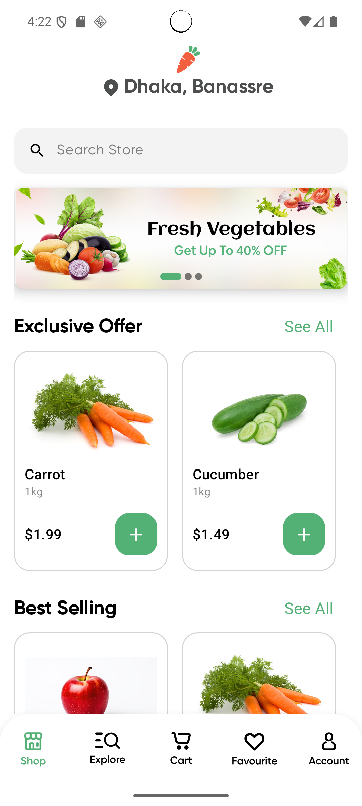
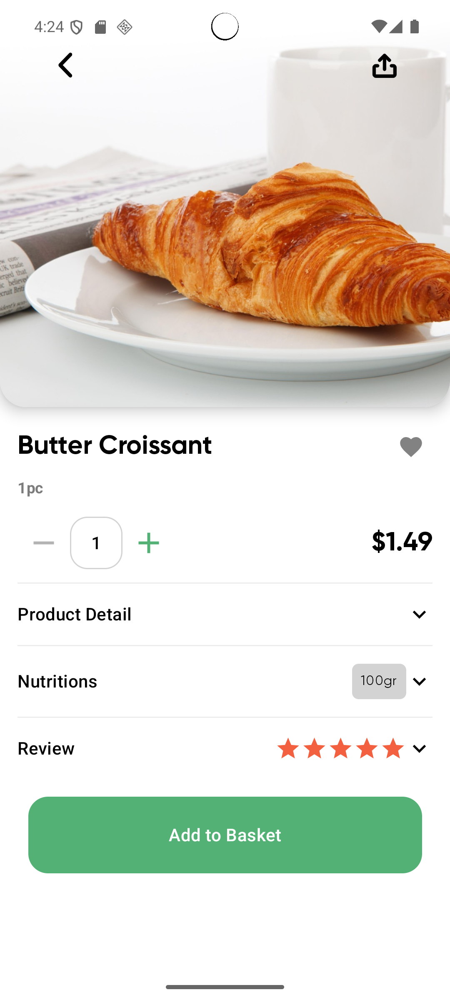
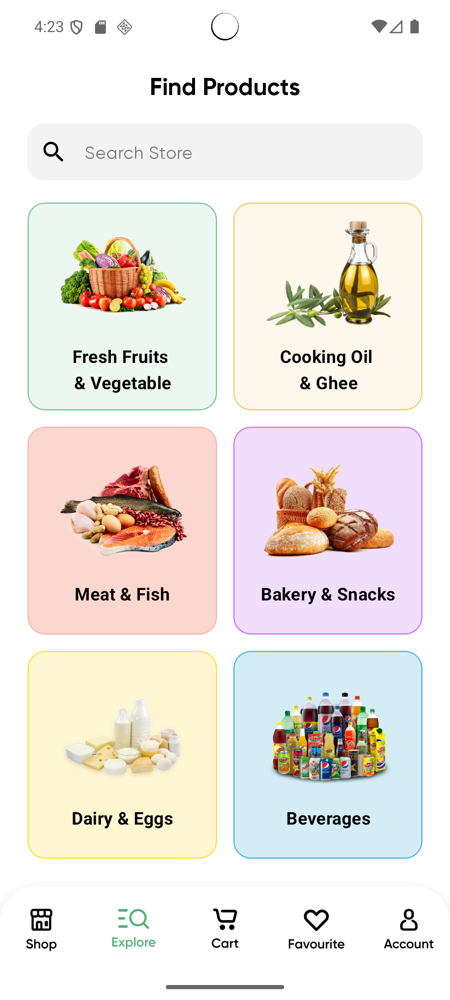
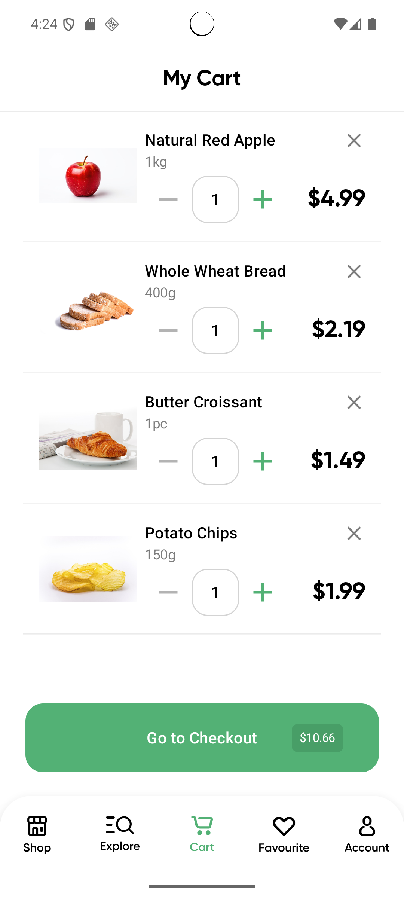

# 🛒 Nectar - Grocery Shopping App

A modern Android grocery shopping application built with **Jetpack Compose** and following **Clean Architecture** principles.

## 📱 Features

### 🏠 Home & Navigation
- **Home Screen** with featured products and categories
- **Bottom Navigation** for easy app navigation
- **Search Functionality** to find products quickly
- **Category-based Shopping** with organized product listings

### 🛍️ Shopping Experience
- **Product Catalog** with detailed product information
- **Product Details** with images, nutrition facts, and descriptions
- **Add to Cart** functionality with quantity selection
- **Shopping Cart** management with item modification
- **Favorites** system to save preferred products

### 📋 Product Management
- **Expandable Product Items** with detailed information
- **Nutrition Information** chips and details
- **Product Images** with proper image handling
- **Price Display** with quantity and pricing options
- **Review and Rating** system

### 🎯 User Experience
- **Onboarding Flow** for new users
- **Order Management** and order history
- **Offer Management** and promotional deals
- **Wide Button Components** for better UX
- **Increment/Decrement Controls** for quantity selection

## 🏗️ Architecture

The app follows **Clean Architecture** principles with clear separation of concerns:

```
📁 com.example.nectar/
├── 📁 data/           # Data layer (repositories, data sources)
├── 📁 di/             # Dependency injection modules
├── 📁 domain/         # Business logic layer
│   ├── 📁 model/      # Domain models
│   ├── 📁 repository/ # Repository interfaces
│   └── 📁 usecase/    # Use cases (business logic)
│       ├── 📁 cartitems/
│       ├── 📁 explore/
│       └── 📁 products/
├── 📁 ui/             # Presentation layer
│   ├── 📁 components/ # Reusable UI components
│   ├── 📁 navigation/ # Navigation setup
│   ├── 📁 screens/    # Screen composables
│   │   ├── 📁 cart/
│   │   ├── 📁 explore/
│   │   ├── 📁 favorite/
│   │   ├── 📁 home/
│   │   ├── 📁 onboarding/
│   │   ├── 📁 order/
│   │   └── 📁 ProductDetail/
│   ├── 📁 theme/      # App theming
│   └── 📁 util/       # UI utilities
└── 📁 util/           # General utilities
```

## 🛠️ Tech Stack

### **Core Technologies**
- **Kotlin** - Primary programming language
- **Jetpack Compose** - Modern UI toolkit
- **Android Architecture Components** - Lifecycle-aware components

### **Architecture & Patterns**
- **Clean Architecture** - Separation of concerns
- **MVVM Pattern** - Model-View-ViewModel
- **Repository Pattern** - Data abstraction
- **Use Cases** - Business logic encapsulation

### **Key Libraries**
- **Compose Navigation** - Navigation between screens
- **Compose Material3** - Material Design components
- **ViewModel** - UI state management
- **Hilt/Dagger** - Dependency injection (likely)
- **Kotlin Coroutines** - Asynchronous programming

## 🚀 Getting Started

### Prerequisites
- **Android Studio** Arctic Fox or newer
- **Minimum SDK**: API 21 (Android 5.0)
- **Target SDK**: API 34
- **Kotlin** 1.9.0+

### Installation

1. **Clone the repository**
   ```bash
   git clone https://github.com/yourusername/nectar-app.git
   cd nectar-app
   ```

2. **Open in Android Studio**
   - Open Android Studio
   - Select "Open an existing project"
   - Navigate to the cloned directory

3. **Build the project**
   ```bash
   ./gradlew build
   ```

4. **Run the app**
   - Connect an Android device or start an emulator
   - Click the "Run" button in Android Studio

## 📦 Key Components

### UI Components
- **AddToCartButton** - Add products to shopping cart
- **Divider** - Visual separation elements
- **IncrementDecrement** - Quantity selection controls
- **ProductCard** - Product display cards
- **ProductGrid** - Grid layout for products
- **SearchBar** - Product search functionality
- **WideButton** - Full-width action buttons

### Screens
- **HomeScreen** - Main dashboard with featured content
- **ProductDetailScreen** - Detailed product information
- **CartScreen** - Shopping cart management
- **ExploreScreen** - Product browsing and search
- **FavoriteScreen** - Saved products
- **OnboardingScreen** - User introduction flow
- **OrderScreen** - Order history and management

### ViewModels
- **NavHostViewModel** - Navigation state management
- **FavoriteScreenViewModel** - Favorites functionality
- **ProductDetailViewModel** - Product detail logic

## 🎨 Design System

The app implements a consistent design system with:
- **Material Design 3** principles
- **Custom color palette** for brand consistency
- **Typography scale** for text hierarchy
- **Component theming** for consistent look and feel
- **Icon system** with custom and material icons

## 🔧 Configuration Files

- **ProGuard Rules** - Code obfuscation and optimization
- **Gradle Build Scripts** - Project and module configuration
- **Version Catalog** - Dependency management
- **Project Properties** - Build configuration

##📱 Screenshots

### Home Screen


### Product Details


### Explore Screen


### Shopping Cart



## 🤝 Contributing

1. Fork the repository
2. Create a feature branch (`git checkout -b feature/amazing-feature`)
3. Commit your changes (`git commit -m 'Add some amazing feature'`)
4. Push to the branch (`git push origin feature/amazing-feature`)
5. Open a Pull Request

## 📋 TODO / Roadmap

- [ ] Add user authentication
- [ ] Implement payment gateway integration
- [ ] Add offline support with Room database
- [ ] Implement push notifications
- [ ] Add dark theme support
- [ ] Include unit and UI tests
- [ ] Add delivery tracking
- [ ] Implement user reviews and ratings

## 📄 License

This project is licensed under the MIT License - see the [LICENSE](LICENSE) file for details.

## 👨‍💻 Author

**Your Name**
- GitHub: (https://github.com/amrrkhaled)
- Email: amr.khaledsaada@gmail.com

